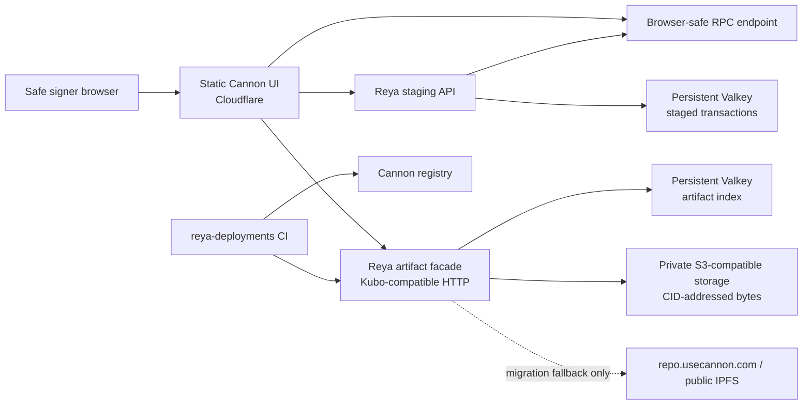

# Reya self-host compatibility contract

Status: source-grounded spike for [PRO-690](https://linear.app/reya-labs/issue/PRO-690/bootstrap-reya-cannon-v3-fork-and-self-host-compatibility-contract). This document describes the checked-in behavior at Cannon commit `7edc8f116a8a4db84f9201a37b852684443105ce` on `dev`. It is not a production deployment runbook and does not authorize a mainnet Safe action.

## Outcome

Reya can self-host the Cannon staging UI and staging API from this fork. Cannon artifacts do not require Reya to operate a public IPFS node: Cannon computes the CID locally from the exact compressed bytes, and the repository service stores those bytes under the CID in S3-compatible storage while presenting the Kubo-compatible `/api/v0/add` and `/api/v0/cat` calls used by the builder and UI.

The current source is a usable starting point, not yet a production-ready self-host distribution. Before a mainnet canary, Reya must harden the staging API, make the artifact mirror recoverable without Cannon's hosted services, parameterize hosted defaults in the UI, and add fork-specific CI and release artifacts. Those changes are split into [PRO-691](https://linear.app/reya-labs/issue/PRO-691/harden-cannon-safe-staging-backend-for-reya-mainnet), [PRO-692](https://linear.app/reya-labs/issue/PRO-692/deploy-reya-cannon-artifact-mirror-and-persistent-valkey), and [PRO-694](https://linear.app/reya-labs/issue/PRO-694/self-host-cannon-ui-with-reya-access-and-runtime-configuration).

## Pinned source and reproducible baseline

The public fork is `Reya-Labs/cannon`. `origin/dev` and `upstream/dev` both resolved to the pinned commit above when this spike was run.

Use Node `20.5.1` and pnpm `10.11.0` for upstream CI parity. The root package permits a broader Node range, while release Dockerfiles use Node 22; Reya should choose and pin one supported release line before producing images.

The following baselines passed from a clean install:

```bash
pnpm i --frozen-lockfile
pnpm build
pnpm --filter backend build
pnpm --filter @usecannon/repo build

REDISMS_SYSTEM_BINARY=/opt/homebrew/bin/redis-server \
  pnpm --filter @usecannon/repo test

pnpm --filter @usecannon/website tsc:build
NEXT_PUBLIC_WALLET_CONNECT_PROJECT_ID=non-secret-build-placeholder \
  pnpm build:website
```

The Redis override is only a local test-harness workaround because dependency install scripts were disabled on the test machine. It is not a production setting. The website build emits a static export in `packages/website/out` and passed with upstream warnings about Contentlayer, ESLint, Sentry tunnelling, and disabled minification; these warnings must be resolved or explicitly accepted in PRO-694.

Upstream PR CI does not cover all of this surface. Root `pnpm build` omits the website, Safe backend, repository and indexer; root `pnpm test` excludes the repository. The Safe backend has no test script. Reya must add explicit package and image gates rather than treating upstream's green checks as self-host readiness.

## Proposed service boundary



The UI can be served as a static Cloudflare asset deployment; nginx is not required. Access policy remains a product/security decision because some Safe signers are external to Reya. A Reya-employee-only SSO gate is insufficient. PRO-694 should choose an explicit signer identity allowlist, for example Cloudflare Access identities that include approved external signers, with Tailscale as an additional operator path rather than the sole browser path.

Browser calls originate outside the cluster, so cluster network policy does not constrain their destinations. The static deployment needs a strict CSP and explicit runtime/build configuration for the staging API, artifact facade, RPC endpoints, wallet connectivity, and any retained analytics/telemetry endpoints.

## What Redis/Valkey persists

The two services have different durability contracts and should use separate instances or at least separately monitored namespaces and credentials.

| Service | Current keys/role | Consequence of loss | Required production posture |
| --- | --- | --- | --- |
| Safe staging backend | `safe-app-backend:<chainId>-<safeAddress>` contains the serialized transaction map and accumulated signatures | Staged proposals and collected signatures disappear after a restart or cache miss | Persistent Valkey with backups, encryption, restricted network access, restore drill, and no eviction |
| Artifact repository | Sorted sets `repo:tempUploadHashes`, `repo:pkgHashes`, and `repo:longTermHashes` authorize/index CIDs; S3 stores the bytes | S3-resident blobs remain readable, but promotion state, upload authorization, and upstream-fallback classification are lost | Persistent Valkey plus a deterministic index-rebuild job from a release manifest/registry traversal |

Running the staging backend without `REDIS_URL` is explicitly supported by the code but stores state only in process memory. That mode is unacceptable for mainnet staging.

## Artifact and CID contract

### CID determinism

For structured Cannon records the builder performs:

1. `JSON.stringify(content)`.
2. `pako.deflate(...)`.
3. `ipfs-only-hash` over the resulting bytes.
4. Upload of those exact bytes to `/api/v0/add`.
5. Rejection if the server's returned `Hash` differs from the locally computed CID.

The repository independently hashes the received bytes and stores them at `${S3_FOLDER}/${cid}`. Therefore the same byte sequence has the same Cannon/IPFS CID without contacting a public IPFS node. A local proof at the pinned commit produced the same CID twice for copied 101-byte buffers:

```text
QmUnSpSUKh9e825fvB7omLNRuLZE8Jyht9ioHjjvf7jXm7
```

The guarantee is byte identity, not merely semantic JSON equality. Reordering object keys or changing the compression output can produce a different CID. Migration should prefer raw byte copying and then independently verify the destination CID.

### Execution and UI artifact closure

A recoverable mirrored deployment is not just the root CID. The closure is:

1. The root `DeploymentInfo` blob referenced by the Cannon registry.
2. Its `miscUrl` blob.
3. Every deployment URL recorded under every `state.*.artifacts.imports` entry.
4. Recursively, each imported deployment's root, `miscUrl`, and imports.
5. Every non-empty registry `metaUrl` associated with a resolved package in that tree. The website reads this separate blob for source/package metadata.

The builder's `forPackageTree` traversal copies the execution-critical root/`miscUrl`/import closure depth-first. Import records are copied whether or not they carry provision tags; the tags affect returned registry publish calls, not blob copying. `metaUrl` copying is currently disabled, so the current builder mirror path is not sufficient for complete UI availability.

The repository server cannot infer the full closure from one root upload. Its `add` route only discovers and authorizes the root's direct `miscUrl`. The migration/backfill job must use builder-side traversal or an equivalent independently verified walker.

### The facade is not a general public IPFS node

The required compatibility surface is deliberately small:

| Request | Current behavior | Reya contract |
| --- | --- | --- |
| `POST /api/v0/add?local=true&to-files=/CID` | Recomputes the CID; accepts already-authorized bytes or any inflated JSON with a CID-shaped `miscUrl`; stores bytes in S3 and returns `{"Hash": "CID"}`. It does not validate the full `DeploymentInfo` schema | Preserve request/response compatibility; authenticate writers and enforce the expected schema/limits |
| `POST /api/v0/cat?arg=CID` | Reads S3 first, otherwise proxies configured `IPFS_URL` according to Redis/JSON checks | Read S3 first; use hosted IPFS only during migration; verify fallback bytes against CID and backfill S3 atomically |
| `HEAD /api/v0/cat?arg=CID` | Checks S3 only | Preserve as the authoritative local-presence probe |

Folder uploads (`wrap-with-directory`) are a separate Pinata-backed feature used for website bundles. They are not needed to preserve the deployment-artifact contract and should be disabled unless PRO-692 identifies a Reya requirement.

### Why keep a public IPFS fallback initially

Reya can reuse `repo.usecannon.com` or another public gateway/node for migration reads and as a time-bounded emergency fallback. It must not be the only durable copy: Cannon can change, deprecate, rate-limit, or stop operating its hosted repository, and public IPFS availability depends on someone retaining/pinning the bytes.

The cutover gate is not "the root CID loads once." Before CI writes only to Reya, a closure manifest for every active and rollback-eligible Reya deployment must prove that every root, `miscUrl`, recursive import, and non-empty registry `metaUrl` is present in Reya S3 and readable with the upstream disabled.

## Current gaps that block production

### Safe staging backend

At the pinned commit the staging backend:

- accepts `PORT`, optional `REDIS_URL`, comma-separated `RPC_URLS`, and truthy `TRUST_PROXY`;
- falls back to viem's public RPC URL for a known chain when no explicit RPC is configured;
- exposes unauthenticated reads and writes with wildcard CORS;
- accepts arbitrary valid chain IDs/Safe addresses supported by its provider lookup;
- rate-limits globally but has no Reya signer identity, Safe allowlist, request audit identity, or idempotent concurrency contract;
- merges signatures with a read/modify/write process that is not protected against concurrent writers;
- writes Redis asynchronously after responding logic and has no automated tests;
- has a broken package `start` path (`src/index.js`) even though TypeScript and the Docker image use `dist/index.js`.

PRO-691 must add an explicit chain/Safe allowlist, authenticated writer identity, deliberate read policy, constrained CORS, mandatory Reya RPCs, strict proxy parsing, atomic signature accumulation, audit logs/metrics, request/body/rate limits, failure-mode tests, and a reproducible image. Execution remains in the user's Safe wallet; the service must never hold signing keys or submit a mainnet transaction autonomously.

### Artifact repository

The current repository service has several recovery and integrity gaps:

- normal artifact uploads and all reads are unauthenticated;
- Redis authorization is written before S3, so a failed S3 write can leave a phantom index entry;
- an existing S3 root short-circuits before reauthorizing its `miscUrl`;
- a registry URL equality shortcut in builder mirroring can skip checking whether destination blobs still exist;
- a changed `miscUrl` CID is logged but does not fail the copy;
- upstream fallback responses are not status/CID-verified and are not cached into S3;
- S3 object-existence misses are memoized without expiry, so an out-of-band restore can remain invisible until cache clear/restart;
- `forcePathStyle` is hard-coded false, excluding some S3-compatible stores;
- application code provides no S3 deletion/retention mechanism; bucket lifecycle policy is external;
- the recursive builder walk has no cycle guard and its deduplication key does not include chain ID or content CID.

PRO-692 must close these gaps or wrap the service with an equivalent hardened implementation while preserving the CID and HTTP contracts above.

### Website and distribution

The static website supports a build-time `NEXT_PUBLIC_API_URL`, while artifact and staging endpoints default in browser-local settings to `https://repo.usecannon.com/` and `https://safe-staging.usecannon.com`. Users can edit those settings, but that is not a safe deployment contract. One browser read path also silently falls back directly to `ipfs.io` after a facade error, which can conceal mirror failure and bypass facade policy. Git operations use a hard-coded `https://git-proxy.repo.usecannon.com`.

PRO-694 must parameterize these defaults, remove or feature-gate the direct `ipfs.io` fallback, decide whether runtime configuration is required, remove or explicitly allow every remaining hosted dependency, and validate CSP/wallet behavior from the deployed Cloudflare origin. Its offline browser smoke test must block public IPFS. The current Sentry tunnel option cannot work with a static export.

The repository has no coherent self-host release today: root CI omits critical packages, the checked-in Compose mapping/configuration is inconsistent with the repo service, the Safe backend's nested workflow is not loaded by GitHub Actions, and server images are manual-only. Reya should publish immutable images/assets with upstream SHA, Reya SHA and digest in a release manifest.

## Migration and recovery acceptance criteria

PRO-692 should implement and exercise this sequence before PRO-693 switches `reya-deployments`:

1. Enumerate the active and rollback-eligible Reya package references and chain IDs from a recorded registry contract, network and block snapshot; resolve both deploy and metadata URLs.
2. Traverse each root/`miscUrl`/import closure and add every non-empty registry `metaUrl` used by the UI.
3. Copy exact raw bytes into private S3-compatible storage under their CIDs.
4. Independently recompute and reject every CID mismatch.
5. Produce a versioned manifest containing package reference, chain ID, registry snapshot, resolved deploy/meta URLs, each CID's root/misc/meta/import role, intended durable Redis index, mutability, byte length, source, destination and verification time.
6. Assert that live registry resolution still matches the snapshot, then rebuild the artifact Redis indexes from the manifest on an empty database. Compare exact sorted-set membership, classification and scores to the manifest, and exercise an isolated authorization/fallback operation whose result depends on each declared durable index class rather than S3 presence alone.
7. Disable fallback at both the repository and browser/CSP layers, restart the facade to clear memoized results, raw-fetch every manifest CID, recompute its CID and compare its byte length.
8. Back up S3/Valkey, delete an isolated test environment, restore it, restart/clear caches, repeat the exact raw-byte proof, and record recovery time.
9. Test the newest package written after cutover with the primary facade unavailable. Cannon's read-only service is only a legacy-miss source; it is not a failover for new Reya writes. If independent failover is required during the rollback window, dual-copy and verify every new CID to that target.
10. Only then change CI publishing to the Reya endpoint. Continue serving Reya S3 during rollback unless the independently verified failover in step 9 is available.

S3 must be private, encrypted and versioned, with blocked public access and scoped service credentials. Reads are exposed only through the facade. Lifecycle rules must not expire any CID referenced by an active or rollback-eligible release manifest.

## Deployment order and ticket boundary

1. **PRO-690:** pin source behavior and compatibility contract (this document).
2. **PRO-691:** harden and test the Safe staging API.
3. **PRO-692:** deploy the artifact facade, S3 and persistent Valkey; backfill and prove offline recovery.
4. **PRO-693:** point `reya-deployments` CI at Reya and add closure verification.
5. **PRO-694:** deploy the static UI through Cloudflare with the approved external-signer access model.
6. **PRO-695:** test-Safe rehearsal, disaster-recovery exercise and bounded mainnet canary.
7. **PRO-696:** optionally make `reya-deployments` private after all consumers, GitHub environments, bots and artifact inputs have been migrated and an authenticated browser Git-read path exists.

Making `reya-deployments` private is not compatible with the current browser staging flow: its Git proxy supplies neither a GitHub authentication callback nor authenticated headers. PRO-694/PRO-696 need a server-side GitHub App/broker with repository/ref allowlisting, short-lived credentials and audit logs; no PAT or long-lived GitHub credential may reach signer browsers. With that addition, privacy is compatible with this architecture, but it remains deliberately last. It reduces source visibility; it does not replace artifact endpoint authentication, Safe policy, or immutable release manifests.

## Questions for Cannon

The following message is ready to send to the Cannon team:

> Thanks — we're bootstrapping a Reya fork from the current `dev` branch and mapping the self-host path. Before we harden/deploy it, could you confirm:
>
> 1. Which v3 tag/commit should self-hosters target, and will the supported bundle include the website, `safe-app-backend`, repo/API services, images and deployment examples?
> 2. Which website endpoints will be officially configurable at build/runtime (API, staging backend, artifact repo, Git proxy, RPCs, registry and telemetry)?
> 3. Is the intended artifact topology still the current Kubo-compatible repo facade backed by S3/Redis plus an upstream IPFS fallback? Is there a supported way to backfill and verify the full root + `miscUrl` + recursive import closure plus non-empty registry `metaUrl` blobs?
> 4. What are the required Redis durability and concurrency semantics for `safe-app-backend`? Are atomic signature merges, multiple replicas and restore behavior part of the v3 work?
> 5. Which auth/CORS/Safe allowlist hooks and health/metrics interfaces do you expect self-hosters to put in front of or configure in the staging API?
> 6. Are `repo.usecannon.com`, `safe-staging.usecannon.com` and `git-proxy.repo.usecannon.com` expected to remain supported fallbacks through a published deprecation window?
> 7. Do you plan to add CI coverage and versioned images for the repo and Safe backend, or should we upstream those changes from our fork?
>
> We want to preserve Cannon CID and registry semantics while ensuring Reya can recover and operate without a hosted Cannon dependency. Happy to share the compatibility matrix/patches as we go.

## Upstream sync policy

Use `upstream/dev` as the synchronization source and `origin/dev` as Reya's integration branch. Open merge-based sync PRs at least weekly and immediately for security fixes; do not rewrite the long-lived fork. Keep Reya deltas small and upstream generic fixes where practical.

Every sync must pass upstream checks plus fork-specific gates for the Safe backend, repository, website export, images, service health, and a browser-to-staging/artifact/RPC smoke test. Promote a tested `origin/dev` commit to `origin/main` and publish a manifest that pins upstream SHA, Reya SHA, package versions, config-schema version, toolchain versions and artifact/image digests.
